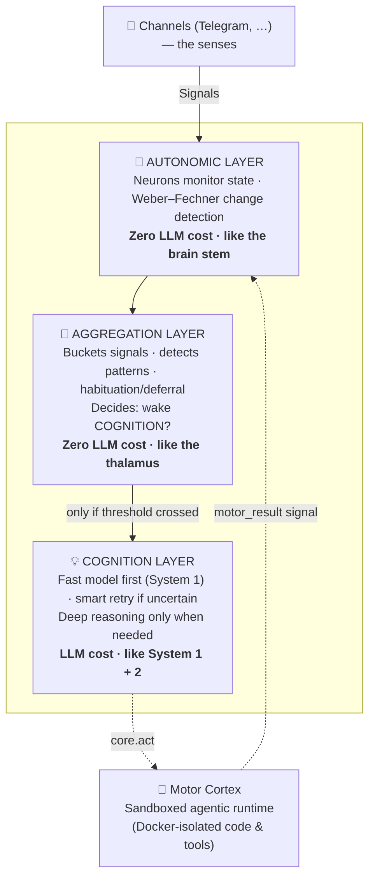

<div align="center">

# 🧠 lifemodel

### A digital human, not a chatbot.

**A human-like, proactive AI agent whose architecture mirrors the human body — senses, neural impulses, brain regions, a heartbeat, and physiology.**

[](LICENSE)
[](https://www.typescriptlang.org/)
[](https://nodejs.org/)
[](https://vitest.dev/)
[](https://prettier.io/)

</div>

---

## What is this?

Most "AI agents" are request/response loops: you send a message, the model replies, nothing happens in between. **lifemodel is built the other way around.** It runs continuously, *feels* internal and external pressure building up over time, and **decides on its own when to think, act, or reach out to you** — the same way a person does.

The guiding metaphor is the human body, taken seriously as an engineering constraint:

| Body | lifemodel |
|------|-----------|
| 👂 Senses | **Channels** (Telegram, …) |
| ⚡ Neural impulses | **Signals** (one unified data model for everything) |
| 🧠 Brain regions | **Layers** (autonomic → aggregation → cognition) |
| ❤️ Heartbeat | **CoreLoop** (a fixed 1-second tick) |
| 🔋 Physiology | **Energy & state** (thinking is expensive; resting is free) |
| 💪 Motor function | **Motor Cortex** (sandboxed code execution & tools) |

This isn't just naming. The metaphor drives real architectural decisions — energy conservation, emergence over polling, and layered processing where cheap reflexes run constantly and expensive reasoning only wakes up when it's truly needed.

---

## ✨ Highlights

- **🔋 Energy-conserving cognition.** Every tick runs free, zero-LLM "autonomic" and "aggregation" layers. The expensive LLM-powered **cognition** layer only wakes up when accumulated pressure crosses a threshold (or you message it directly). No wasteful polling, no burning tokens to do nothing.
- **🌱 Emergence over polling.** The agent doesn't run on timers asking "should I do something now?". State *accumulates*, pressure builds, and actions **emerge** when thresholds are crossed — proactive messages, thoughts, reminders.
- **⚡ Signals, not events.** Everything that flows through the system — a Telegram message, an internal urge, an overdue commitment — is a single unified `Signal` type. One model for all data flow.
- **🧠 Two-speed thinking (System 1 + System 2).** A cheap **fast model** handles classification and quick reactions; an expensive **smart model** is escalated to only on low confidence (and only when it's safe to retry). Inspired by Kahneman's dual-process theory.
- **💪 Sandboxed Motor Cortex.** When the agent needs to *act* (run code, fetch data, use a skill), it dispatches to a separate agentic runtime that executes inside **per-run Docker containers** — `--read-only`, `--network none`, `--cap-drop ALL`, strict resource limits. Results flow back as signals.
- **🗂️ Dual-layer long-term memory.** A **vector store** (semantic recall, salience decay) backed by [LanceDB](https://lancedb.com/) combined with a **graph store** (entities, relations, spreading activation) for associative context.
- **🧩 Strictly-isolated plugin system.** Core *never* imports plugin types. Plugins extend the agent (neurons, channels, tools, providers, filters) only through a small `PluginPrimitives` API.
- **📜 Agent Skills standard.** Skills declare their own dependencies (`npm` / `pip` / `apt`) and are loaded into the sandbox with content-addressed dependency caching.

---

## 🏗️ Architecture

### The 3-Layer Brain

Signals enter through channels and flow up through progressively more expensive layers. Most ticks never reach the top.



> Most ticks: only **autonomic** and **aggregation** run. **Cognition** wakes for user messages or threshold crossings. The smart (expensive) model is used only on retry — when confidence is low *and* it's safe to retry.

### The Heartbeat (CoreLoop)

A fixed **1-second tick** drives everything:

1. Collect signals from channels (sensory input)
2. Update **thought pressure** & **desire pressure** from memory
3. Check overdue **commitments** and **predictions** → emit signals
4. **Autonomic** layer: neurons emit internal signals
5. **Aggregation** layer: collect, aggregate, decide wake threshold
6. **Cognition** layer (only if woken): process with the LLM
7. Apply the intents returned by all layers

### The Agentic Loop (Cognition)

Cognition uses **native OpenAI tool-calling** with *Codex-style natural termination* — the model stops calling tools when it's done; there's no mandatory "final" tool. It supports smart escalation (`core.escalate`), smart retry on low confidence, and proactive deferral (`core.defer`) so the agent can choose *not* to interrupt you right now.

📖 Full details: **[`docs/architecture.md`](docs/architecture.md)**

---

## 🚀 Quick Start

### Prerequisites

- **Node.js ≥ 24**
- **Docker** — required for the Motor Cortex's agentic (code-executing) runs
- A **Telegram bot token** ([@BotFather](https://t.me/BotFather))
- An **[OpenRouter](https://openrouter.ai/)** API key (or any OpenAI-compatible endpoint — LM Studio, Ollama, vLLM, …)

### Install & run

```bash
# 1. Clone
git clone https://github.com/shady2k/lifemodel.git
cd lifemodel

# 2. Install dependencies
npm install

# 3. Configure environment (see below)
cp .env.example .env   # then edit .env

# 4. Run in development (hot-reload via tsx)
npm run dev

# — or build & run for production —
npm run build
npm start
```

### Configuration

lifemodel is configured via a `.env` file. The essentials:

| Variable | Description |
|----------|-------------|
| `TELEGRAM_BOT_TOKEN` | Your Telegram bot token from [@BotFather](https://t.me/BotFather) |
| `PRIMARY_USER_CHAT_ID` | Your Telegram chat ID (DM [@userinfobot](https://t.me/userinfobot) to get it) — enables proactive messaging |
| `OPENROUTER_API_KEY` | API key from [openrouter.ai](https://openrouter.ai/) |
| `LLM_FAST_MODEL` | Cheap model for classification / yes-no / emotion detection |
| `LLM_SMART_MODEL` | Expensive model for reasoning & message composition |
| `LLM_MOTOR_MODEL` | Model used by the Motor Cortex agentic runtime |
| `TZ` | Your timezone (e.g. `Europe/Moscow`) |
| `LOG_LEVEL` | `info`, `debug`, … |

<details>
<summary><b>Optional: run on local / self-hosted models</b></summary>

Any OpenAI-compatible server works (LM Studio, Ollama, LocalAI, vLLM):

| Variable | Description |
|----------|-------------|
| `LLM_LOCAL_BASE_URL` | Base URL of your OpenAI-compatible server |
| `LLM_LOCAL_MODEL` | Local model name |
| `LLM_LOCAL_USE_FOR_FAST` | Use the local model for the *fast* role |
| `LLM_LOCAL_USE_FOR_SMART` | Use the local model for the *smart* role (usually keep cloud) |
| `LLM_LOCAL_USE_FOR_MOTOR` | Use the local model for the *motor* role |

</details>

<details>
<summary><b>Optional: web search providers</b></summary>

| Variable | Description |
|----------|-------------|
| `SERPER_API_KEY` | [Serper](https://serper.dev/) API key |
| `TAVILY_API_KEY` | [Tavily](https://tavily.com/) API key |
| `SEARCH_PROVIDER_PRIORITY` | Provider fallback order |

</details>

---

## 🧩 Plugins

Capabilities are added through strictly-isolated plugins — neurons (monitor state), channels (senses), tools (cognition capabilities), providers (external services), and filters (signal transformation).

| Plugin | Type | What it does |
|--------|------|--------------|
| `reminder` | tool | Natural-language reminders with recurrence |
| `thoughts` | neuron | Builds **thought pressure** from accumulated unprocessed thoughts |
| `social-debt` | neuron | Builds **social pressure** from lack of interaction |
| `calories` | tool + neuron | Tracks food, calories & weight with proactive deficit monitoring |
| `news` | tool + filter | Fetches & filters news articles by your interests |
| `web-search` / `web-fetch` | tool | Search the web and fetch/clean page content |

📖 Plugin model & API: **[`docs/plugins/overview.md`](docs/plugins/overview.md)**

---

## 📚 Documentation

The codebase is heavily documented. Start here:

- **[Architecture](docs/architecture.md)** — the 3-layer brain, CoreLoop, the agentic loop, project structure
- **Concepts** — [Signals](docs/concepts/signals.md) · [Intents](docs/concepts/intents.md) · [Energy](docs/concepts/energy-model.md) · [Memory](docs/concepts/memory.md) · [Soul](docs/concepts/soul.md) · [Conversation history](docs/concepts/conversation-history.md)
- **Features** — [Thinking](docs/features/thinking.md) · [News](docs/features/news.md) · [Reminders](docs/features/reminders.md) · [Commitments](docs/features/commitments.md) · [Desires](docs/features/desires.md) · [Social debt](docs/features/social-debt.md) · [Motor Cortex](docs/features/motor-cortex/design.md)
- **Plugins** — [Overview](docs/plugins/overview.md) · [Neurons](docs/plugins/neurons.md) · [Channels](docs/plugins/channels.md)
- **[Architecture Decision Records](docs/adr/)** — the *why* behind key choices

---

## 🛠️ Tech Stack

**Language & runtime:** TypeScript (strict, ESM) on Node.js ≥ 24
**LLM:** [Vercel AI SDK](https://sdk.vercel.ai/) · [OpenRouter](https://openrouter.ai/) · OpenAI-compatible providers
**Memory:** [LanceDB](https://lancedb.com/) (vector store) + a custom graph store · [Transformers.js](https://huggingface.co/docs/transformers.js) embeddings
**Channels:** [grammY](https://grammy.dev/) (Telegram)
**Sandbox:** Docker-isolated runtime + IPC
**Infra:** [Fastify](https://fastify.dev/) · [Pino](https://getpino.io/) logging · [Zod](https://zod.dev/) validation · [Luxon](https://moment.github.io/luxon/) time

---

## 🧪 Development

```bash
npm run dev          # run with hot reload (tsx)
npm run build        # compile TypeScript → dist/
npm start            # run the compiled build

npm test             # run the test suite (vitest)
npm run test:watch   # watch mode

npm run lint         # eslint
npm run typecheck    # tsc --noEmit
npm run format       # prettier --write
```

Tests live under `tests/` (unit, integration, helpers) — never inside `src/`. Pre-commit hooks (Husky + lint-staged) enforce lint & formatting.

---

## 📁 Project Structure

```
src/
├── core/        # CoreLoop, Agent, energy, event-bus  — the heartbeat
├── layers/      # autonomic/ · aggregation/ · cognition/  — the brain
├── runtime/     # Motor Cortex, sandbox, shell, containers, skills
├── llm/         # provider interface, tool-schema conversion
├── plugins/     # modular extensions (neurons, tools, …)
├── channels/    # sensory organs (Telegram, …)
├── storage/     # persistence, dual-layer memory, conversations
├── ports/       # external service adapters
├── types/       # Signal, Intent, Cognition, Commitment, Desire, …
├── models/      # UserModel (preferences)
└── config/      # configuration loading
```

---

## 📄 License

Released under the [MIT License](LICENSE).

---

<div align="center">
<sub>Built as a study in what an AI agent looks like when you model it as a body, not a search box.</sub>
</div>
