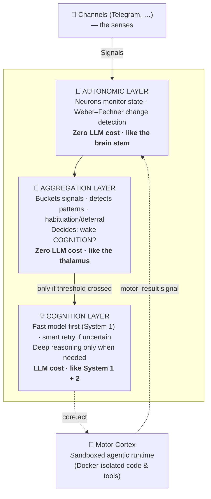

<div align="center">

# 🧠 lifemodel

### A digital human, not a chatbot.

**A human-like, proactive AI agent whose architecture mirrors the human body — senses, neural impulses, brain regions, a heartbeat, and physiology.**

[](LICENSE)
[](https://www.typescriptlang.org/)
[](https://nodejs.org/)
[](https://vitest.dev/)
[](https://prettier.io/)

</div>

---

## What is this?

Most "AI agents" are request/response loops: you send a message, the model replies, nothing happens in between. **lifemodel is built the other way around.** It runs continuously, *feels* internal and external pressure building up over time, and **decides on its own when to think, act, or reach out to you** — the same way a person does.

The guiding metaphor is the human body, taken seriously as an engineering constraint:

| Body | lifemodel |
|------|-----------|
| 👂 Senses | **Channels** (Telegram, …) |
| ⚡ Neural impulses | **Signals** (one unified data model for everything) |
| 🧠 Brain regions | **Layers** (autonomic → aggregation → cognition) |
| ❤️ Heartbeat | **CoreLoop** (a fixed 1-second tick) |
| 🔋 Physiology | **Energy & state** (thinking is expensive; resting is free) |
| 💪 Motor function | **Motor Cortex** (sandboxed code execution & tools) |

This isn't just naming. The metaphor drives real architectural decisions — energy conservation, emergence over polling, and layered processing where cheap reflexes run constantly and expensive reasoning only wakes up when it's truly needed.

---

## ✨ Highlights

- **🔋 Energy-conserving cognition.** Every tick runs free, zero-LLM "autonomic" and "aggregation" layers. The expensive LLM-powered **cognition** layer only wakes up when accumulated pressure crosses a threshold (or you message it directly). No wasteful polling, no burning tokens to do nothing.
- **🌱 Emergence over polling.** The agent doesn't run on timers asking "should I do something now?". State *accumulates*, pressure builds, and actions **emerge** when thresholds are crossed — proactive messages, thoughts, reminders.
- **⚡ Signals, not events.** Everything that flows through the system — a Telegram message, an internal urge, an overdue commitment — is a single unified `Signal` type. One model for all data flow.
- **🧠 Two-speed thinking (System 1 + System 2).** A cheap **fast model** handles classification and quick reactions; an expensive **smart model** is escalated to only on low confidence (and only when it's safe to retry). Inspired by Kahneman's dual-process theory.
- **💪 Sandboxed Motor Cortex.** When the agent needs to *act* (run code, fetch data, use a skill), it dispatches to a separate agentic runtime that executes inside **per-run Docker containers** — `--read-only`, `--network none`, `--cap-drop ALL`, strict resource limits. Results flow back as signals.
- **🗂️ Dual-layer long-term memory.** A **vector store** (semantic recall, salience decay) backed by [LanceDB](https://lancedb.com/) combined with a **graph store** (entities, relations, spreading activation) for associative context.
- **🧩 Strictly-isolated plugin system.** Core *never* imports plugin types. Plugins extend the agent (neurons, channels, tools, providers, filters) only through a small `PluginPrimitives` API.
- **📜 Agent Skills standard.** Skills declare their own dependencies (`npm` / `pip` / `apt`) and are loaded into the sandbox with content-addressed dependency caching.

---

## 🏗️ Architecture

### The 3-Layer Brain

Signals enter through channels and flow up through progressively more expensive layers. Most ticks never reach the top.


```mermaid
flowchart TD
    TG["📡 Channels (Telegram, …)<br/>— the senses"] -->|Signals| AUT

    subgraph BRAIN [" "]
        direction TB
        AUT["🧬 AUTONOMIC LAYER<br/>Neurons monitor state · Weber–Fechner change detection<br/><b>Zero LLM cost · like the brain stem</b>"]
        AGG["🔀 AGGREGATION LAYER<br/>Buckets signals · detects patterns · habituation/deferral<br/>Decides: wake COGNITION?<br/><b>Zero LLM cost · like the thalamus</b>"]
        COG["💡 COGNITION LAYER<br/>Fast model first (System 1) · smart retry if uncertain<br/>Deep reasoning only when needed<br/><b>LLM cost · like System 1 + 2</b>"]
        AUT --> AGG
        AGG -->|only if threshold crossed| COG
    end

    COG -.->|core.act| MC["💪 Motor Cortex<br/>Sandboxed agentic runtime<br/>(Docker-isolated code & tools)"]
    MC -.->|motor_result signal| AUT
```

> Most ticks: only **autonomic** and **aggregation** run. **Cognition** wakes for user messages or threshold crossings. The smart (expensive) model is used only on retry — when confidence is low *and* it's safe to retry.

### The Heartbeat (CoreLoop)

A fixed **1-second tick** drives everything:

1. Collect signals from channels (sensory input)
2. Update **thought pressure** & **desire pressure** from memory
3. Check overdue **commitments** and **predictions** → emit signals
4. **Autonomic** layer: neurons emit internal signals
5. **Aggregation** layer: collect, aggregate, decide wake threshold
6. **Cognition** layer (only if woken): process with the LLM
7. Apply the intents returned by all layers

### The Agentic Loop (Cognition)

Cognition uses **native OpenAI tool-calling** with *Codex-style natural termination* — the model stops calling tools when it's done; there's no mandatory "final" tool. It supports smart escalation (`core.escalate`), smart retry on low confidence, and proactive deferral (`core.defer`) so the agent can choose *not* to interrupt you right now.

📖 Full details: **[`docs/architecture.md`](docs/architecture.md)**

---

## 🚀 Quick Start

### Prerequisites

- **Node.js ≥ 24**
- **Docker** — required for the Motor Cortex's agentic (code-executing) runs
  and for the isolated test boundary (see [Test isolation](#-development))
- A **Telegram bot token** ([@BotFather](https://t.me/BotFather))
- An **[OpenRouter](https://openrouter.ai/)** API key (or any OpenAI-compatible endpoint — LM Studio, Ollama, vLLM, …)

### Install & run

```bash
# 1. Clone
git clone https://github.com/shady2k/lifemodel.git
cd lifemodel

# 2. Install dependencies
npm install

# 3. Configure environment (see below)
cp .env.example .env   # then edit .env

# 4. Run in development (hot-reload via tsx)
npm run dev

# — or build & run for production —
npm run build
npm start
```

To run a whole instance instead — the loader, the login and lifemodel as a
service on its own volume — see [Run your own instance](#-run-your-own-instance).

### Configuration

lifemodel is configured via a `.env` file. The essentials:

| Variable | Description |
|----------|-------------|
| `TELEGRAM_BOT_TOKEN` | Your Telegram bot token from [@BotFather](https://t.me/BotFather) |
| `PRIMARY_USER_CHAT_ID` | Your Telegram chat ID (DM [@userinfobot](https://t.me/userinfobot) to get it) — enables proactive messaging |
| `OPENROUTER_API_KEY` | API key from [openrouter.ai](https://openrouter.ai/) |
| `LLM_FAST_MODEL` | Cheap model for classification / yes-no / emotion detection |
| `LLM_SMART_MODEL` | Expensive model for reasoning & message composition |
| `LLM_MOTOR_MODEL` | Model used by the Motor Cortex agentic runtime |
| `TZ` | Your timezone (e.g. `Europe/Moscow`) |
| `LOG_LEVEL` | `info`, `debug`, … |

<details>
<summary><b>Optional: run on local / self-hosted models</b></summary>

Any OpenAI-compatible server works (LM Studio, Ollama, LocalAI, vLLM):

| Variable | Description |
|----------|-------------|
| `LLM_LOCAL_BASE_URL` | Base URL of your OpenAI-compatible server |
| `LLM_LOCAL_MODEL` | Local model name |
| `LLM_LOCAL_USE_FOR_FAST` | Use the local model for the *fast* role |
| `LLM_LOCAL_USE_FOR_SMART` | Use the local model for the *smart* role (usually keep cloud) |
| `LLM_LOCAL_USE_FOR_MOTOR` | Use the local model for the *motor* role |

</details>

<details>
<summary><b>Optional: web search providers</b></summary>

| Variable | Description |
|----------|-------------|
| `SERPER_API_KEY` | [Serper](https://serper.dev/) API key |
| `TAVILY_API_KEY` | [Tavily](https://tavily.com/) API key |
| `SEARCH_PROVIDER_PRIORITY` | Provider fallback order |

</details>

---

## 🐳 Run your own instance

The published image runs a whole instance in one container: the **loader**
(the password, first start, panic), **Caddy** as the only web entrance,
**Agent Vault** (the layer that holds the keys, so lifemodel holds none), and
lifemodel itself as an unprivileged user whose code is a git repository on the
volume — so it can change itself and keep the change across restarts.

```bash
docker run -d \
  --name lifemodel \
  --restart unless-stopped \
  --stop-timeout 120 \
  --cap-add NET_ADMIN \
  -v lifemodel:/var/lib/lifemodel \
  -p 127.0.0.1:8080:80 \
  ghcr.io/shady2k/lifemodel:main
```

Then open **http://boot.localhost:8080**: the loader asks you to set its
password, and after that it creates the instance's repository on the volume
from the code the image carries, builds it and starts lifemodel. Nothing asks
you for a model key at this point.

| Address | What it is |
| --- | --- |
| `boot.localhost:8080` | the loader: its password, panic and resume |
| `localhost:8080` | lifemodel's own interface |
| `vault.localhost:8080` | Agent Vault: its own interface — the vault, the keys and the services |

`localhost` is the machine's own name and the others are its subdomains. On a
VPS, reach them through an SSH tunnel and keep them unpublished:

```bash
ssh -N -L 8080:127.0.0.1:8080 you@your-vps
```

`vault.` reaches Agent Vault's own interface, behind the same login; the root
host answers that nothing is there yet until lifemodel's own interface is built
(lifemodel-q4x.4). The port is published on the host's loopback only
(`-p 127.0.0.1:8080:80`), so nothing on the internet reaches it — put your own
HTTPS proxy in front when you want that.

The rest of the command: the volume `lifemodel` holds the instance (its
repository and its data — `docker rm -f` and the same `docker run` bring the
same instance back), and `--stop-timeout 120` gives the whole stop room: the
loader's own stop has one 110-second deadline, counted from the moment the
signal arrives, for lifemodel's 90-second drain, for Agent Vault leaving after
it and for Caddy leaving last. No step
of the stop waits past that deadline (some have shorter caps of their own), so
the loader leaves before Docker's own kill at 120 seconds; when a step could
not finish, it leaves with a non-zero code and one line naming what was still
pending and which bound it hit. A process the kernel will not let go of even
after SIGKILL is the one case where the loader leaves without having reaped
it. `--cap-add NET_ADMIN` is for the **next** task: when lifemodel's traffic is
confined to Agent Vault's proxy (lifemodel-q4x.3.2), the loader installs the
kernel rule that does it and needs that capability. **No such rule is installed today**
— lifemodel can still reach the network directly — so the flag is carried, not
yet used. Agent Vault itself is already in the image and running:
it holds a passwordless store in `/var/lib/lifemodel/vault` (root-only), and
the loader creates the vault `lifemodel` and an agent token for it and gives
that token to lifemodel's process as its proxy credential.

From the command line, inside the container:

```bash
docker exec lifemodel lifemodel status   # running|stopped|failed, the commit, panic on|off
                                         # (failed adds a line: failed: <the reason>)
docker exec lifemodel lifemodel panic    # stop lifemodel and keep it down
docker exec lifemodel lifemodel resume   # clear panic and start it again
docker logs -f lifemodel                 # the loader's, Caddy's and Agent Vault's lines
```

Build the image yourself with `scripts/build-image.sh`: it makes the seed
bundle from your checkout first (a full clone — a shallow one is refused by
name) and then runs the `docker build`. What the image holds and how the front
door routes the three hosts is in
[`docs/features/instance/image.md`](docs/features/instance/image.md).

---

## 🧩 Plugins

Capabilities are added through strictly-isolated plugins — neurons (monitor state), channels (senses), tools (cognition capabilities), providers (external services), and filters (signal transformation).

| Plugin | Type | What it does |
|--------|------|--------------|
| `reminder` | tool | Natural-language reminders with recurrence |
| `thoughts` | neuron | Builds **thought pressure** from accumulated unprocessed thoughts |
| `social-debt` | neuron | Builds **social pressure** from lack of interaction |
| `calories` | tool + neuron | Tracks food, calories & weight with proactive deficit monitoring |
| `news` | tool + filter | Fetches & filters news articles by your interests |
| `web-search` / `web-fetch` | tool | Search the web and fetch/clean page content |

📖 Plugin model & API: **[`docs/plugins/overview.md`](docs/plugins/overview.md)**

---

## 📚 Documentation

The codebase is heavily documented. Start here:

- **[Architecture](docs/architecture.md)** — the 3-layer brain, CoreLoop, the agentic loop, project structure
- **Concepts** — [Signals](docs/concepts/signals.md) · [Intents](docs/concepts/intents.md) · [Energy](docs/concepts/energy-model.md) · [Memory](docs/concepts/memory.md) · [Soul](docs/concepts/soul.md) · [Conversation history](docs/concepts/conversation-history.md)
- **Features** — [Thinking](docs/features/thinking.md) · [News](docs/features/news.md) · [Reminders](docs/features/reminders.md) · [Commitments](docs/features/commitments.md) · [Desires](docs/features/desires.md) · [Social debt](docs/features/social-debt.md) · [Motor Cortex](docs/features/motor-cortex/design.md)
- **Plugins** — [Overview](docs/plugins/overview.md) · [Neurons](docs/plugins/neurons.md) · [Channels](docs/plugins/channels.md)
- **[Architecture Decision Records](docs/adr/)** — the *why* behind key choices

---

## 🛠️ Tech Stack

**Language & runtime:** TypeScript (strict, ESM) on Node.js ≥ 24
**LLM:** [Vercel AI SDK](https://sdk.vercel.ai/) · [OpenRouter](https://openrouter.ai/) · OpenAI-compatible providers
**Memory:** [LanceDB](https://lancedb.com/) (vector store) + a custom graph store · [Transformers.js](https://huggingface.co/docs/transformers.js) embeddings
**Channels:** [grammY](https://grammy.dev/) (Telegram)
**Sandbox:** Docker-isolated runtime + IPC
**Infra:** [Fastify](https://fastify.dev/) · [Pino](https://getpino.io/) logging · [Zod](https://zod.dev/) validation · [Luxon](https://moment.github.io/luxon/) time

---

## 🧪 Development

```bash
npm run dev          # run with hot reload (tsx)
npm run build        # compile TypeScript → dist/
npm start            # run the compiled build

npm test             # run the test suite inside the disposable test boundary
npm run test:docker  # the launcher's docker mode
npm run test:watch   # unsupported — see Test isolation below

npm run check        # typecheck + lint + format + suite, via the isolated launcher
npm run lint         # eslint
npm run typecheck    # tsc --noEmit
npm run format       # prettier --write
```

Tests live under `tests/` (unit, integration, helpers) — never inside `src/`. Pre-commit hooks (Husky + lint-staged) enforce lint & formatting on staged files, then run the product checks through the isolated launcher.

### Test isolation

The suite never starts on the host. `npm test` and `npm run check` start
`scripts/test-isolated.mjs`, which runs the checks and the suite one-shot and
bounded inside a disposable Node 24 container built from a selective snapshot
of the tree. The run never sees your `.env`, your `data/` state, your git
credentials or your Docker daemon — nothing of your checkout is bind-mounted
and no Docker socket is mounted — and the launcher stops and removes the
containers it started when the run ends, fails, times out or is interrupted
(a hard kill leaves a container that the next run prunes and reports).

Prerequisites for tests and checks: **Node.js ≥ 24 and Docker**. Watch mode is
explicitly unsupported (`npm run test:watch` explains why and exits): run a
bounded one-shot suite instead, e.g.
`node scripts/test-isolated.mjs test -- tests/unit/energy-management.test.ts`.
Ordinary checks use an offline, non-root Node 24.21.0 container (2 CPUs,
3 GiB memory, no extra swap, 256 processes). Its root is read-only; temporary
writes use capped memory-backed filesystems. Dependencies are installed inside
a container and cached. Per-run containers and source images are removed after
success, failure, timeout or interruption. The default deadline is 25 minutes.

`docker` mode uses a private rootless daemon in a disposable OrbStack machine
on macOS: no Mac mounts, no SSH forwarding, and network isolation from the host
and other machines. Its limits are 2 CPUs, 4 GiB memory and 32 GiB disk. OrbStack
shares a Linux kernel; it is not a hardware VM. Missing or unsupported backends
fail closed, never to your socket or a privileged fallback. CI runs ordinary
checks through the same launcher with GitHub's disposable Docker daemon.

Real boundary checks (each runs its test workload inside the boundary):

```bash
node scripts/accept-test-isolation.mjs
node scripts/accept-docker-isolation.mjs success
node scripts/accept-docker-isolation.mjs interrupt
node scripts/accept-docker-isolation.mjs timeout
```

The launch lock prevents overlapping heavy runs. Do not run raw `npx vitest` or
install host dependencies just to test. See [AGENTS.md](AGENTS.md#test-isolation)
for cleanup, cache and argument policy.

---

## 📁 Project Structure

```
src/
├── core/        # CoreLoop, Agent, energy, event-bus  — the heartbeat
├── layers/      # autonomic/ · aggregation/ · cognition/  — the brain
├── runtime/     # Motor Cortex, sandbox, shell, containers, skills
├── llm/         # provider interface, tool-schema conversion
├── plugins/     # modular extensions (neurons, tools, …)
├── channels/    # sensory organs (Telegram, …)
├── storage/     # persistence, dual-layer memory, conversations
├── ports/       # external service adapters
├── types/       # Signal, Intent, Cognition, Commitment, Desire, …
├── models/      # UserModel (preferences)
└── config/      # configuration loading
```

---

## 📄 License

Released under the [MIT License](LICENSE).

---

<div align="center">
<sub>Built as a study in what an AI agent looks like when you model it as a body, not a search box.</sub>
</div>
